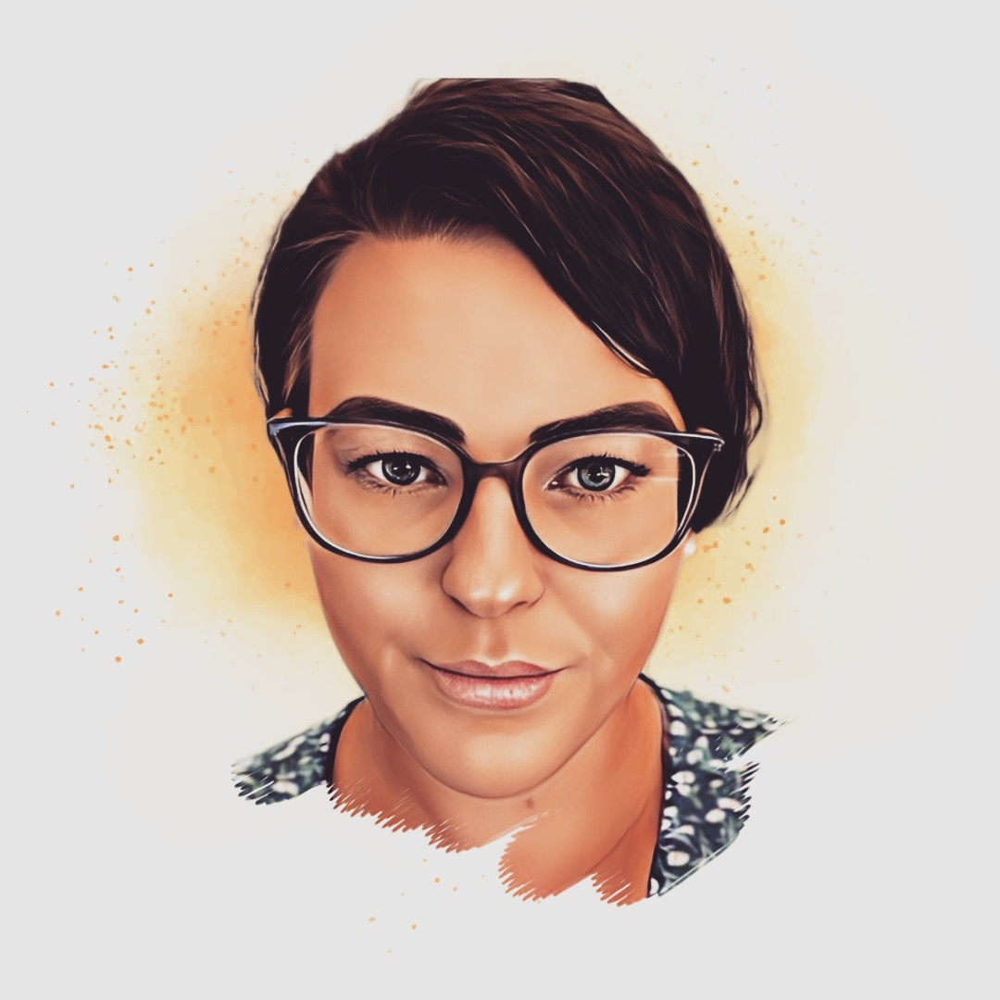

# Nicole Warren                     

### Person Information

Nicole Warren
_Student Number:
Student Email Address:_

I am 31yrs old, I have two beautiful children and work full time for Guide Dogs Queensland. I was born in Australia and have lived in Queensland my entire life, I love to go camping and spend my spare time with my family enjoying the outdoors, whether that is at the beach or going hiking. I have two dogs a border collie and a wolfhound, both who are extremely mischievous. Everything I have learnt about IT has been self-taught over the last two years.

### Interest In IT

_What is your interest in IT? When did you interest in IT start?_
Ever since I was little, I have always had an interest in how technology works but it wasn’t until I started my current job two years ago that my interested in IT became a passion. Over the last two years I have gone from not knowing anything in regards to developing programs to creating and implementing systems that I have helped develop. Currently I use salesforce as my current platform for development and love that I can improve how my department and company can more efficiently collect and compile data. 
_Was there a particular event or person that sparked your interest? Outline your IT experience_
When I started my current job my first task was to implement our new CRM system, I spent numerous hours researching on how this system works and how to utilize all the features to ensure best practice was achieved. Throughout all my research and many hours of trailheads I discovered how much I enjoyed the process and over time I have continued to improve my skill set by working my way up to creating and modifying the system. Over the last two years I have create formstack documents, import and export large volumes of data, build a small webpage, help with the development of our client portal, modify, and implement an inventory and ordering system and much more. 
_Why did you choose to come to RMIT?_
I have investigated multiple universities that offer IT programs and after discussing all my options with open universities they agreed that RMIT would be the best fit for me, with the excellent reviews of great communication with teachers and lectures and the curriculum being vast and well planned I decided to enrol.
_What do you expect to learn during your studies?_
I want to learn the basics of what you need to know when starting in the IT industry, to learn new skills and be able to apply those skills into my current work. To see how to work within a team from an IT dynamic and how to branch ideas. To learn the IT lingo and how to write project reports to be presented to executives. I chose to do this course to see if I can achieve what is required to do my Bachelor of Information Technology. I hope that once I complete my studies, I will be able to achieve my dream of becoming a software developer. 

### Ideal Job
**_Salesforce Developer_**

[Lumay Job Ad](https://jobs.lever.co/Lumary/f7da78d3-ae07-4b44-975d-47f6babe76fd)

As a Senior Developer at Lumary you will be enhancing the Lumary products using clean, functional and tested code. You will work as part of an Agile team, adopting the best practices and implementing them in everyday tasks.

Our roles are defined to an extent so we (and our peers) understand our key domain/s as detailed above and below in ‘a day in the life’. However, we don't restrict people by title or function -  the team members do whatever they can, using whatever skills they have to achieve the goals. Everyone is supported and encouraged to sense the environment around them, identify and solve problems, contribute insights, and add value wherever they can across Lumary.

Lumary's culture encourages problem-solving, innovation and outside the box thinking and celebrates creativity.

Working with your team, you will feel empowered to decide how you are going to shape the Lumary products to provide quality outcomes for our customers.  With insights from our customer success, product teams, and user groups, take ownership and be proactive, innovate and continue to evolve our product suite so that we can improve the quality of life for our customers' participants

**Day In a Life**
- Start the morning by staying connected, nurture and grow your relationships with your peers -  discuss you challenges and share your focus and ideas
- Understand the problem space - reflect on the insights with the team and design solutions
- Ensure the sustainability and maintain the quality of the product but continuing to set and uphold the standards and quality of the product
- Grow both personally and professionally by investing in learning and self development - from internal LMS learning, to mentoring, coaching, pair programming, plural sight, to meditation and mindfulness.
- Connect with your Peers - attend Zoom / Google meetings, have a chat on Slack or join fun- filled conversations on Donut Catchup

### Personal Profile

           

                                                                

**What do the results of these tests mean for you?**
Seeing all the different results from each test is insightful for numerous reasons, it gives me the opportunity to understand how I can apply myself and get the best outcome within both my work and person life. I can identify what are my strengths and gives me the opportunity to work on my shortcomings.

**How do you think these results may influence your behaviour in a team?**
With everyone having both strengths and weaknesses, it may make it harder for me to be able to speak my mind or voice my opinions due to the lack of confidence I have in a group setting. To try and overcome this shortcoming I will need to set aside my doubts and strive to be a valuable contributing member of my team. 

**How should you take this into account when forming a team?**

### Project Idea 

**Overview** 
My Project idea is to create a phone app called “Must Have.” This app would have the ability to scan what someone is wearing either by pointing the camera at the person or uploading a photo to the app, once scanned it would then give links to all the websites for the items of clothing or products. It can also benefit other retail industries such as furniture, bags, fishing equipment and so much more. For a many people, this app would give them the opportunity to be able to find that piece of clothing that they wouldn’t have been able to find otherwise. 

**Motivation (100) words)**
This should be a description of why the project will be interesting or useful. This may include statistics or other evidence, such as: "There service. are 1.5 billion cat owners in Australia, and so there is a huge market for an automated cat feeder. Using Raspberry Pi technology is a cheap and easily assembled solution to this problem." 

**Description (500 words)** 
Detailed description of the features of the product or service 

**Tools and Technologies (100) words)**
Describe the software, hardware and/or other equipment needed. Include any relevant open source tools as appropriate. 

**Skills Required (100 words)**
List the skills are required for your project, including software that needs to be written, and special hardware (if any). How feasible will it be to find the skills, software and hardware required? 

**Outcome (100 words)**
If the project is successful, what will be the outcome? How will the original problem be solved? What impact will this development have?

